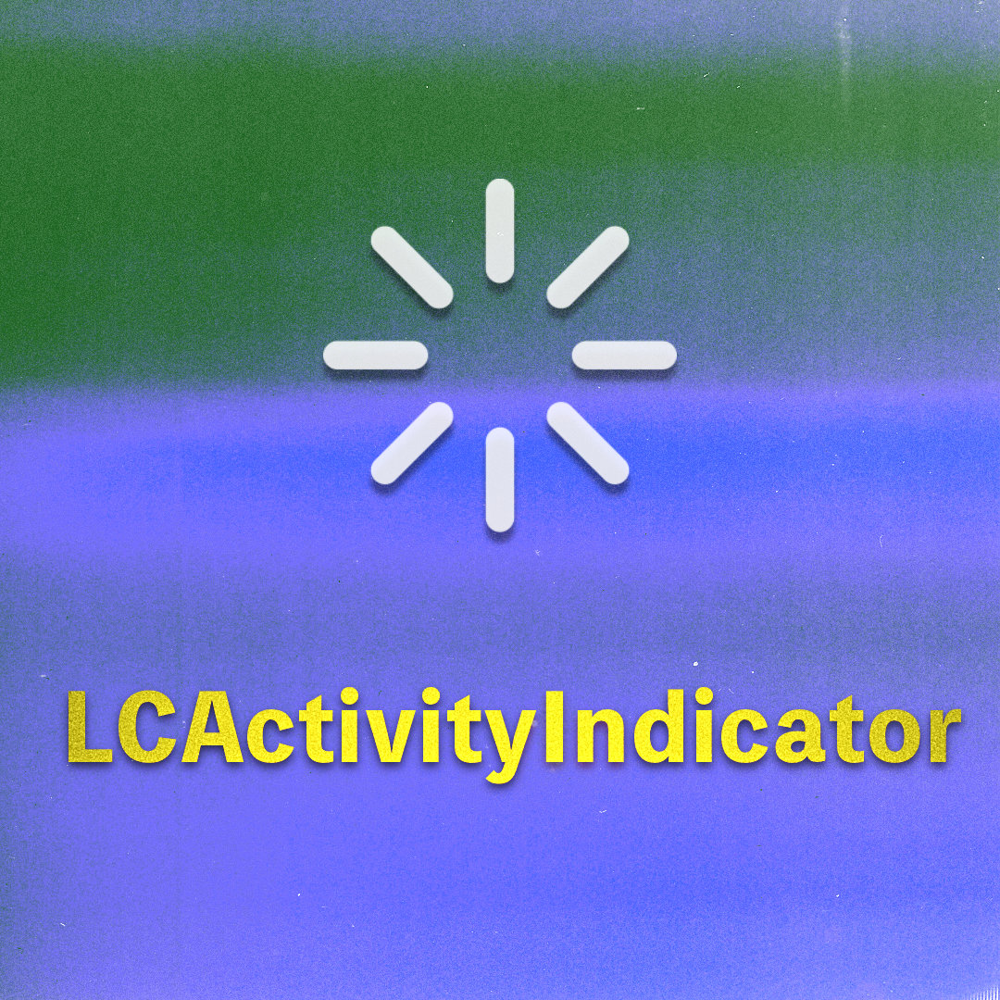
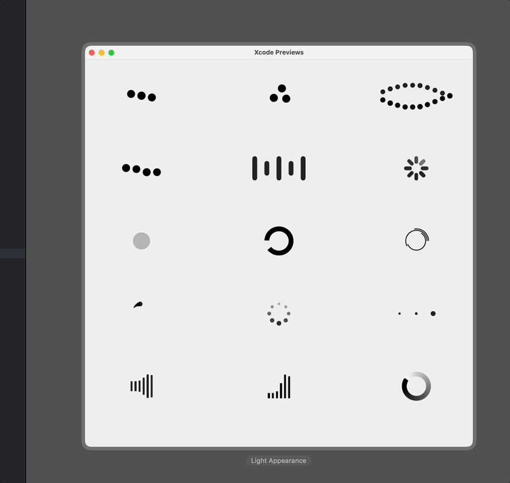

<p align="center">


<p align="center"> <b> LCActivityIndicator is a portable framework with many preset loading indicators created using SwiftUI！</b></p>


<p align="center">
  <a href="https://swiftpackageindex.com/DevLiuSir/LCActivityIndicator">
        
    </a>
    <a href="https://swiftpackageindex.com/DevLiuSir/LCActivityIndicator">
        
    </a>
    


<a href="https://twitter.com/LiuChuan_"></a>
</p>

---

### Design
<p align="center">

</p>


## Usage

```swift
public enum LCIndicatorType {
    case `default`(count: Int)
    case threeBallsRotation(Color, size: CGFloat)
    case threeBallsTriangle(Color, size: CGFloat)
    case threeBallsBouncing(Color, size: CGFloat, speed: CGFloat)
    case doubleHelix(Color, size: CGFloat, count: Int)
    case arcs(count: Int, lineWidth: CGFloat)
    case rotatingDots(count: Int)
    case flickeringDots(count: Int)
    case scalingDots(count: Int, spacing: Int)
    case audioWaveEqualizer(Color, count: Int)
    case equalizer(count: Int)
    case growingArc(Color, lineWidth: CGFloat)
    case pulseCircle
    case accordion(count: Int)
    case gradient(colors: [Color], lineCap: CGLineCap, lineWidth: CGFloat)
}
```


- Default type, passing the number of points

```swift
LCActivityIndicator(isVisible: $isAnimate, type: .default(count: 8))
```


- Three points rotating animation

```swift
LCActivityIndicator(isVisible: $isAnimate, type: .threeBallsRotation(.black, size: 50))
```


- Three points forming a triangle rotating animation

```swift
LCActivityIndicator(isVisible: $isAnimate, type: .threeBallsTriangle(.black, size: 50))
```

- Three points bouncing vertically

```swift
LCActivityIndicator(isVisible: $isAnimate, type: .threeBallsBouncing(.black, size: 50, speed: 0.5))
```


- Double helix animation

```swift
LCActivityIndicator(isVisible: $isAnimate, type: .doubleHelix(.black, size: 150, count: 10))
```


- Arc-shaped indicator, creating multiple arcs

```swift
LCActivityIndicator(isVisible: $isAnimate, type: .arcs(count: 3, lineWidth: 2))
```

- Rotating dot indicator, multiple dots rotating

```swift
LCActivityIndicator(isVisible: $isAnimate, type: .rotatingDots(count: 5))
```


- Flickering dot indicator, dots flickering in change

```swift
LCActivityIndicator(isVisible: $isAnimate, type: .flickeringDots(count: 8))
```

- Scaling dot indicator, dots scaling in and out

```swift
LCActivityIndicator(isVisible: $isAnimate, type: .scalingDots(count: 3, spacing: 2))
```

- Music waveform equalizer, dynamic equalizer based on sound frequencies

```swift
LCActivityIndicator(isVisible: $isAnimate, type: .audioWaveEqualizer(.black, count: 6))
```

- Equalizer indicator, showing dynamic bars like audio frequencies

```swift
LCActivityIndicator(isVisible: $isAnimate, type: .equalizer(count: 6))
```

- Growing arc indicator, arcs growing continuously

```swift
LCActivityIndicator(isVisible: $isAnimate, type: .growingArc(.black, lineWidth: 10))
```

- Pulse circle indicator, the circle changes over time

```swift
LCActivityIndicator(isVisible: $isAnimate, type: .pulseCircle)
```


- Accordion indicator, multiple bars bouncing at different heights

```swift
LCActivityIndicator(isVisible: $isAnimate, type: .accordion(count: 5))
```


- Gradient indicator, circular gradient effect

```swift
LCActivityIndicator(isVisible: $isAnimate, type: .gradient(colors: [.white, .black], lineCap: .round, lineWidth: 10))
```


---

## Install
#### SwiftPackage

Add `https://github.com/DevLiuSir/LCActivityIndicator.git` in the [“Swift Package Manager” tab in Xcode](https://developer.apple.com/documentation/xcode/adding_package_dependencies_to_your_app).


## License

MIT License

Copyright (c) 2025 Marvin


## Author

| [](https://github.com/DevLiuSir)  |  [DevLiuSir](https://github.com/DevLiuSir)<br/><br/><sub>Software Engineer</sub><br/> [][1] [][2] [][3]|
| :------------: | :------------: |

[1]: https://twitter.com/LiuChuan_
[2]: https://github.com/DevLiuSir
[3]: https://devliusir.com/

